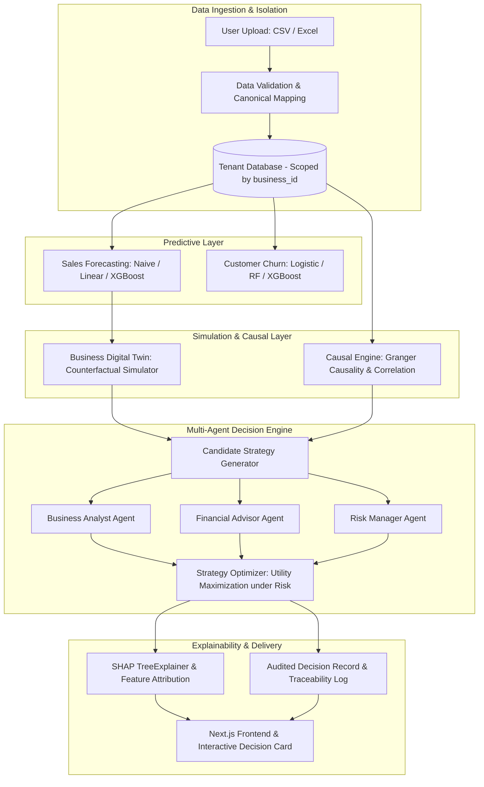

# DecisionGPT

<div align="center">

[](https://fastapi.tiangolo.com)
[-000000.svg?style=flat&logo=next.js&logoColor=white)](https://nextjs.org)
[](https://www.typescriptlang.org/)
[](https://www.python.org/)
[](file:///tests)
[](file:///frontend)
[](https://github.com/shap/shap)
[](https://xgboost.readthedocs.io)

**Strategic Decision-Support Platform with Predictive Analytics, Digital Twin Counterfactual Simulation, Dynamic Causal Discovery, and Multi-Agent Consensus Optimization.**

</div>

---

## Overview

**DecisionGPT** is an auditable, research-grounded decision-support platform designed to help small-to-medium enterprises (SMEs) and data-driven businesses evaluate, simulate, and optimize complex operational and pricing strategies.

Rather than relying on ungrounded language models to hallucinate business advice or static dashboards that only summarize past performance, DecisionGPT builds an end-to-end analytical pipeline:
1. **Predicts** future business metrics (sales demand, customer churn) using trained machine learning models.
2. **Simulates** alternative strategic interventions (pricing shifts, marketing reallocations, inventory adjustments) in a counterfactual Business Digital Twin sandbox.
3. **Discovers & labels causal relationships** using time-series Granger Causality F-tests and correlation analysis.
4. **Reconciles strategic trade-offs** using a multi-agent consensus debate between specialized agents (*Business Analyst*, *Financial Advisor*, *Risk Manager*) resolved by a constrained *Strategy Optimizer*.
5. **Explains** recommendations with local and global SHAP (SHapley Additive exPlanations) attribution.
6. **Enforces a Zero-Fabrication Boundary**: all numerical forecasts, confidence intervals, causal edge weights, and agent scores originate strictly from deterministic models and stored data; the LLM is restricted to structuring natural-language inputs and formatting narrative summaries.

> [!IMPORTANT]
> **Decision-Support Guardrail**: DecisionGPT is a strategic simulation and decision-support tool. It generates auditable recommendations with uncertainty bounds; it never executes direct monetary transactions, automatic price modifications, or irreversible business operations.

---

## Problem Statement

Small and Medium Enterprises (SMEs) face critical decision-making challenges:
- **Descriptive vs. Prescriptive Gap**: Traditional Business Intelligence (BI) tools visualize historical data but fail to answer *"What should we do next?"* and *"What are the likely consequences of alternative choices?"*.
- **Uncertainty & Risk Misestimation**: Naive growth strategies often prioritize top-line revenue at the expense of cash-flow runway, unit margins, and inventory stockout risks.
- **Correlation vs. Causation Pitfalls**: Decision-makers frequently mistake seasonal spikes or promotional correlation for causal drivers, leading to wasteful capital allocation.
- **Black-Box LLM Hallucinations**: Generic Large Language Models lack mathematical grounding, hallucinating business statistics, inventing KPI forecasts, and providing unverifiable advice.

---

## Objectives

1. **Provide Counterfactual Simulation**: Enable risk-free sandbox evaluation of business interventions before committing operational capital.
2. **Establish Empirical Decision-Making**: Ground all business projections in verified time-series forecasting and classification models.
3. **Resolve Multi-Stakeholder Conflicts**: Balance competing business priorities (growth vs. margin vs. downside risk) through structured agent debate and mathematical optimization.
4. **Ensure Total Auditability & Traceability**: Guarantee that every recommendation is traceable to specific model versions, causal graph states, and simulation parameters.
5. **Guarantee Scientific Integrity**: Maintain strict pre-registration protocols, deterministic fallbacks, and reproducible evaluation benchmarks.

---

## Key Features

- 🔮 **Business Digital Twin**: Simulates price elasticity, marketing spend changes, and inventory replenishment dynamics with uncertainty quantification.
- 🕸️ **Dynamic Causal Discovery**: Evaluates empirical time-series relationships using Granger Causality F-tests and Pearson correlation, marking edges with explicit evidence labels (`unsupported`, `correlated`, `causally_validated`).
- 👥 **Multi-Agent Consensus Engine**: Three specialist agents (*Business Analyst*, *Financial Advisor*, *Risk Manager*) independently evaluate candidate strategies, with a *Strategy Optimizer* selecting the Pareto-optimal action under calibrated risk penalties.
- 🔍 **Explainable AI (SHAP)**: Local TreeExplainer decompositions and global feature importance metrics explain exactly why a strategy was chosen.
- 🛡️ **Zero-Fabrication Architecture**: Strict boundary separating ML computation from narrative generation. If no LLM API key is provided, the platform operates completely deterministically in demo/fallback mode.
- 🏢 **Multi-Tenant Data Isolation**: All operational data, ingestion pipelines, database queries, and model registry artifacts are strictly partitioned by `business_id`.
- 🔬 **Research & Benchmark Console**: Dedicated, token-gated academic environment (`/research`) featuring reproducible benchmark suites, model drift tracking, and LaTeX/CSV exports.
- 🎤 **Voice Accessibility**: Optional browser-native speech input and text-to-speech output in English, Hindi, and Tamil to improve mobile accessibility.

---

## System Architecture



---

## How It Works

### 1. Data Ingestion & Validation
Users upload multi-sheet Excel workbooks or CSV files containing sales transactions, customer activity, marketing spend, or inventory snapshots. The backend validates column schemas, detects missing fields, and stores records isolated by `business_id`.

### 2. Prediction Layer
The platform trains and queries models from the local model registry (`models/`):
- **Sales Forecasting**: Quantifies baseline revenue trends using Naive, Ridge Linear, and XGBoost regressors over rolling horizons (7 to 90 days).
- **Customer Churn**: Evaluates churn probabilities using Logistic Regression, Random Forest, and XGBoost classifiers.

### 3. Simulation & Digital Twin Layer
The Digital Twin constructs a counterfactual environment modeling:
- **Price Elasticity of Demand**: Projected volume shifts given price modifications.
- **Marketing Response Curves**: Diminishing returns on incremental ad spend.
- **Inventory Depletion & Stockout Risk**: Safety stock buffer and order replenishment cycles.
- **Uncertainty Intervals**: Lower and upper bounds computed from model residual variance.

### 4. Dynamic Causal Discovery
The causal module analyzes historical time-series pairs using bivariate Granger Causality regressions:
$$\text{KPI}_t = \alpha + \sum_{i=1}^p \beta_i \text{KPI}_{t-i} + \sum_{j=1}^q \gamma_j \text{Intervention}_{t-j} + \epsilon_t$$
Relationships that achieve statistical significance ($p < 0.05$) after $F$-testing are marked as causally validated edges; others remain correlation hypotheses or unverified links.

### 5. Multi-Agent Decision Engine & Strategy Optimizer
1. **Candidate Generation**: Generates actionable combinations across Price ($\Delta P$), Marketing ($\Delta M$), and Inventory ($\Delta I$).
2. **Specialist Agent Scoring**:
   - **Business Analyst**: Focuses on market share, revenue maximization, and sales velocity.
   - **Financial Advisor**: Prioritizes net profit margin, ROI, and cash runway preservation.
   - **Risk Manager**: Penalizes inventory stockout exposure, extreme price elasticity swings, and historical volatility.
3. **Consensus Optimization**: The Strategy Optimizer solves for the candidate strategy $s^*$ maximizing global expected utility:
$$s^* = \arg\max_{s} \left[ w_{\text{rev}} U_{\text{analyst}}(s) + w_{\text{fin}} U_{\text{finance}}(s) - \lambda_{\text{risk}} \text{RiskPenalty}(s) \right]$$

### 6. Explainability (SHAP Attribution)
Local SHAP decompositions explain individual decision rankings by attributing positive and negative score contributions to underlying features (e.g., current gross margin, demand trend, volatility).

### 7. Zero-Fabrication Boundary
All numerical values (revenue projections, churn risk percentages, agent scores, $p$-values) are calculated deterministically by backend services. When configured, an LLM provider generates contextual natural-language narratives explaining the pre-computed results. If `LLM_API_KEY` is omitted, deterministic rule-based explanations are used automatically.

---

## Research and Evaluation

DecisionGPT incorporates a rigorous, pre-registered experimental evaluation framework for benchmarking decision architectures under controlled conditions.

### Evaluation Protocol (R1 Suite)
The evaluation compares four distinct decision architectures across **4,080 locked scenario evaluations** (12 scenario families $\times$ 5 parameter combinations $\times$ 68 seeds $\times$ 4 architectures):
- **Architecture A (Heuristic Baseline)**: Rule-based heuristic decision policy.
- **Architecture B (Single-Agent Greedy)**: Single objective-maximizing agent without risk calibration.
- **Architecture C (Multi-Agent Unconstrained)**: Multi-agent debate without calibrated downside penalties.
- **Architecture D (Full DecisionGPT)**: Multi-agent consensus with Digital Twin counterfactual simulation and calibrated risk constraints.

### Statistical Methodology
- **Pre-Registration**: Scenario seeds, effect size metrics, and hypotheses were frozen prior to locked execution.
- **Primary Effect Size**: Matched-pair Rank-Biserial Correlation ($r_B$) on scenario-level paired rank comparisons.
- **Multiplicity Adjustment**: Confirmatory hypothesis family adjusted using the Holm-Bonferroni step-down procedure.
- **Separation of Ground Truth**: Simulation ground truth systems are isolated from the evaluation harness and decision agents to prevent data leakage.

### Integrity & Reproducibility Audits
The repository includes automated integrity verification scripts ensuring zero manual fabrication, immutable artifact hashes, and complete audit coverage:
```bash
# Run R1 Machine Integrity Audit (26/26 checks)
python scripts/run_eval_r1.py audit

# Run V2 Scientific Audit (14/14 checks)
python scripts/run_eval_v2.py audit

# Run Upgraded Evaluation Audit (14/14 checks)
python scripts/run_upgraded_eval.py audit

# Verify forbidden claim language and claim bounds
python scripts/scan_r1_claims.py
```

---

## Project Structure

```
DecisionGPT/
├── backend/                  # FastAPI backend application
│   ├── alembic/              # Database migration scripts (0001 to 0007)
│   ├── app/
│   │   ├── agents/           # Multi-agent decision logic & strategy optimizer
│   │   ├── analytics/        # Digital Twin, Causal Graph, KPI & Churn services
│   │   ├── api/v1/           # REST endpoints & research routers
│   │   ├── core/             # Configuration, security, middleware & logging
│   │   ├── db/               # SQLAlchemy models & session management
│   │   ├── evaluation/       # Controlled evaluation harness, ground truth & stats
│   │   ├── models/           # ORM entity declarations
│   │   ├── schemas/          # Pydantic request/response schemas
│   │   └── services/         # Business services, LLM provider & data ingestion
│   └── scripts/              # SQLite bootstrap & admin user utilities
├── frontend/                 # Next.js 16 (App Router) + Tailwind CSS frontend
│   ├── src/
│   │   ├── app/              # Application routes (Dashboard, Decisions, Twin, Research)
│   │   ├── components/       # UI components, cards, charts, voice controls
│   │   └── lib/              # API clients, session management & voice utilities
│   └── public/               # Static assets & icons
├── ml/                       # Machine learning pipelines & adapters
│   ├── causal/               # Granger Causality & correlation discovery
│   ├── evaluation/           # Model metrics & SHAP explainability
│   ├── features/             # Feature extractors for forecasting & churn
│   ├── pipeline/             # Model loaders, preprocessors & registry
│   ├── preprocessing/        # Dataset adapters (Indian benchmarks & retail)
│   └── training/             # Model training routines (XGBoost, RF, Linear)
├── data/                     # Platform data, benchmark datasets & registry
│   ├── platform/             # Synthetic platform data (sales, customers)
│   ├── external/             # External benchmark datasets & metadata
│   └── research_uploads/     # Stored research upload artifacts
├── docs/                     # Comprehensive architecture, PRD & research specs
│   ├── ieee_paper/           # IEEE research paper manuscript & references
│   ├── ieee_paper_r1/        # R1 revision manuscript & figures
│   └── figures/              # Vector figures & generation scripts
├── experiments/              # Pre-registered results, manifests & audit logs
│   ├── r1/                   # R1 locked evaluation data & statistics
│   ├── upgraded_controlled_v1/ # V1 controlled benchmark results
│   └── upgraded_controlled_v2/ # V2 pre-lock diagnostics
├── models/                   # Local ML model registry storage
├── overleaf/                 # Publication-ready LaTeX package
├── scripts/                  # Evaluation runners, figure generators & audit scripts
└── tests/                    # Backend automated test suite (Pytest)
```

---

## Technology Stack

### Backend & Machine Learning
- **Framework**: [FastAPI 0.115](https://fastapi.tiangolo.com)
- **Runtime**: Python 3.11 / 3.12
- **Database & ORM**: PostgreSQL 15+ (Production) / SQLite (Development) with SQLAlchemy 2.0 & Alembic
- **Machine Learning**: [XGBoost](https://xgboost.readthedocs.io), [Scikit-Learn](https://scikit-learn.org), [Pandas](https://pandas.pydata.org), [NumPy](https://numpy.org)
- **Explainable AI**: [SHAP (SHapley Additive exPlanations)](https://github.com/shap/shap)
- **Statistical Testing**: [SciPy](https://scipy.org), [Statsmodels](https://www.statsmodels.org)
- **Testing**: Pytest, AnyIO, Starlette TestClient

### Frontend
- **Framework**: [Next.js 16 (App Router + Turbopack)](https://nextjs.org)
- **Language**: TypeScript 5.0+
- **Styling**: TailwindCSS 4
- **Visualization**: [Recharts](https://recharts.org), Lucide React
- **Testing**: Vitest, React Testing Library

---

## Datasets

The platform utilizes three distinct dataset tiers:

1. **Platform Synthetic Datasets (`data/platform/`)**:
   - `churn/customers.csv`: Customer-level behavioral dataset (recency, frequency, monetary value, tenure, returns).
   - `forecasting/sales_timeseries.csv`: Multi-product daily sales time series with pricing, promotions, and inventory levels.

2. **External Indian Market Datasets (`data/external/`)**:
   - `india_ecommerce`: Order-level Indian e-commerce transactions across states, categories, and payment methods.
   - `india_customer_synthetic`: Simulated Indian customer purchasing behavior and target attainment.
   - `india_context`: Indian festival calendar (Diwali, Eid, Holi, Pongal) and macroeconomic indicators (RBI CPI, repo rates) for contextual feature enrichment.
   - `india_agmarknet`: Agricultural commodity market price series adapter.

3. **Retired Non-Indian Benchmarks (`data/external/_retired_non_indian/`)**:
   - `m5_forecasting`, `regional_retail`, `uci_online_retail`: Preserved exclusively for historical baseline comparison and feature adapter validation.

---

## Installation

### Prerequisites
- **Python**: 3.11 or 3.12
- **Node.js**: 20.x or higher (with `npm`)
- **Git**

### Step-by-Step Setup

```bash
# 1. Clone the repository
git clone https://github.com/VARDHANKANDA/DecisionGPT.git
cd DecisionGPT

# 2. Setup Python Virtual Environment
cd backend
python -m venv .venv

# On Windows (PowerShell):
.venv\Scripts\Activate.ps1
# On Linux / macOS:
# source .venv/bin/activate

# 3. Install backend dependencies
pip install -r requirements.txt
cd ..

# 4. Install frontend dependencies
cd frontend
npm install
cd ..
```

---

## Configuration

Copy the example environment configuration file:

```bash
cp .env.example .env
```

Key environment variables in `.env`:

| Variable | Description | Default |
| :--- | :--- | :--- |
| `PROJECT_NAME` | Name of the deployment | `DecisionGPT` |
| `DATABASE_URL` | SQLAlchemy database URL | `sqlite:///./backend/dev.db` |
| `SECRET_KEY` | JWT token signing key | `change-this-in-production-min-32-chars` |
| `RESEARCH_CONSOLE_TOKEN` | Access token for the `/research` console | `research-token-change-in-prod` |
| `LLM_PROVIDER` | Optional LLM provider (`openai`, `anthropic`, `openai_compatible`) | `None` (Deterministic Fallback) |
| `LLM_API_KEY` | Optional API key for LLM narrative generation | `None` |
| `LLM_MODEL` | Model identifier | `gpt-4o-mini` / `claude-sonnet-4-20250514` |

---

## Running the Application

### Backend

```bash
# 1. Bootstrap the local SQLite database
DATABASE_URL=sqlite:///./backend/dev.db python backend/scripts/dev_bootstrap_sqlite.py

# 2. Train baseline models (generates model registry artifacts in models/)
python -m ml.training.train_forecasting
python -m ml.training.train_churn

# 3. Start the FastAPI backend server (http://127.0.0.1:8000)
PYTHONPATH=. DATABASE_URL=sqlite:///./backend/dev.db uvicorn app.main:app --app-dir backend --host 127.0.0.1 --port 8000 --reload
```

Interactive API documentation will be available at [http://127.0.0.1:8000/docs](http://127.0.0.1:8000/docs).

### Frontend

In a separate terminal:

```bash
cd frontend
npm run dev
```

Open [http://localhost:3000](http://localhost:3000) in your browser.

- Click **"Try Demo Business"** to explore the built-in synthetic SME store (`"demo-business"`) with pre-loaded transactional data, or register a new business account.

---

## Running Tests

### Backend Test Suite (Pytest)
Executes all unit, integration, API, and E2E workflow tests:

```bash
backend/.venv/Scripts/python -m pytest
```

*(Expected output: 387 passed, 1 skipped due to external network dependency).*

### Frontend Test Suite (Vitest)
Executes all component and integration tests:

```bash
npm --prefix frontend test -- --run
```

*(Expected output: 60 passed across 9 test files).*

---

## Running Experiments

To reproduce the pre-registered research evaluations and audits:

```bash
# 1. Run the R1 Machine Integrity Audit (verifies 26 pre-registration constraints)
backend/.venv/Scripts/python scripts/run_eval_r1.py audit

# 2. Run the V2 Scientific Audit
backend/.venv/Scripts/python scripts/run_eval_v2.py audit

# 3. Run the Upgraded Controlled Evaluation Audit
backend/.venv/Scripts/python scripts/run_upgraded_eval.py audit

# 4. Perform automated scan for prohibited/unsupported claim language
backend/.venv/Scripts/python scripts/scan_r1_claims.py
```

---

## Reproducibility

To regenerate paper figures from verified experiment data:

```bash
# Generate R1 SVG figures from experiments/r1/figure_data.json
backend/.venv/Scripts/python scripts/r1_figures.py

# Generate primary architecture figures in docs/figures/
backend/.venv/Scripts/python docs/figures/make_figures.py
```

All immutable evaluation checksums and artifact manifests are tracked in `experiments/r1/checksums.txt` and `experiments/upgraded_controlled_v1/checksums.txt`.

---

## Research Paper

The repository includes complete LaTeX manuscripts, bibliographies, and figures ready for submission or compilation on Overleaf:
- **`docs/ieee_paper/`**: Primary manuscript ([`main.tex`](docs/ieee_paper/main.tex), [`references.bib`](docs/ieee_paper/references.bib)).
- **`docs/ieee_paper_r1/`**: R1 revised manuscript with expanded statistical analyses ([`main.tex`](docs/ieee_paper_r1/main.tex)).
- **`overleaf/`**: Standalone, self-contained Overleaf bundle ([`overleaf/main.tex`](overleaf/main.tex)).

---

## Limitations

- **Synthetic & Controlled Benchmark Focus**: Primary quantitative evaluations are conducted under pre-registered, simulated scenario families. While external Indian retail and macroeconomic datasets are integrated, end-to-end multi-year longitudinal studies on live SME deployments remain ongoing work.
- **Granger Causality vs. Structural Intervention**: Granger causality identifies predictive precedence in time-series data; it does not replace randomized controlled trials (RCTs) or comprehensive structural causal models with unobserved confounders.
- **Decision-Support Boundary**: Recommendations must be reviewed by business owners with domain context; the platform does not automate physical inventory orders or financial transactions.

---

## Future Work

- **Live SME Field Deployments**: Longitudinal field tracking of decision recommendations and observed business outcomes using the implemented `DecisionOutcome` schema.
- **Multi-Modal Document Parsing**: Automated ingestion and OCR extraction from GST invoices and scanned vendor receipts.
- **Advanced Causal Discovery**: Integration of FCI/DoWhy non-linear causal discovery algorithms under unobserved latent confounders.

---

## License

This project is licensed under the [MIT License](LICENSE).
