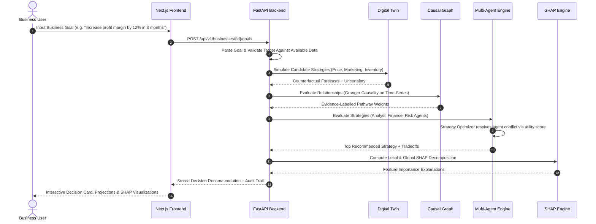

# 🧠 DecisionGPT

<div align="center">

[](https://fastapi.tiangolo.com)
[-000000.svg?style=flat&logo=next.js&logoColor=white)](https://nextjs.org)
[](https://www.typescriptlang.org/)
[](https://www.python.org/)
[](file:///tests)
[](https://github.com/shap/shap)
[](https://xgboost.readthedocs.io)

**AI-Powered Strategic Decision-Support Platform with Predictive Analytics, Digital Twin Simulation, Dynamic Causal Discovery, and Multi-Agent Consensus.**

[Key Features](#-key-features) • [Architecture](#-architecture) • [Decision Pipeline](#-how-it-works-the-decision-pipeline) • [Quick Start](#-quick-start) • [Research Console](#-research-console) • [Verification](#-testing--quality-assurance)

</div>

---

## 📌 Executive Summary

Traditional Business Intelligence (BI) tools only answer:
1. *What happened in the past?* (Descriptive Analytics)
2. *What might happen next?* (Predictive Analytics)

**DecisionGPT answers the crucial next questions:**
- **What should the business consider doing right now?** (Prescriptive Strategy)
- **What will happen under alternative actions?** (Counterfactual Simulation)
- **Why is this the optimal strategy?** (SHAP Explainability & Causal Reasoning)
- **What are the downside risks and uncertainties?** (Multi-Agent Consensus)

Designed primarily for Indian SMEs, startups, D2C brands, and retail/e-commerce businesses (with INR ₹ as the default currency), DecisionGPT combines a **Business Digital Twin**, **Granger-causality graph discovery**, **SHAP feature attribution**, and a **4-Agent Decision Engine** into an auditable, verifiable recommendation platform.

> [!IMPORTANT]  
> **Decision-Support Guardrail**: DecisionGPT recommends and simulates strategic actions; it **never** directly executes financial transactions, price modifications, or irreversible business operations.

---

## 🌟 Key Features

| Capability | What It Does | Why It Matters |
| :--- | :--- | :--- |
| 🔮 **Business Digital Twin** | Simulates price adjustments, marketing spend reallocation, and inventory rebalancing using trained forecasting models. | Test business decisions in a risk-free synthetic sandbox before committing capital. |
| 🕸️ **Dynamic Causal Graph** | Computes statistical correlation and Granger Causality F-tests on real business time-series data. | Prevents confusing correlation with causation; relationships are marked as hypotheses until statistically proven. |
| 👥 **Multi-Agent Decision Engine** | 3 specialist agents (*Business Analyst*, *Financial Advisor*, *Risk Manager*) score candidate strategies through structured debate, resolved by a *Strategy Optimizer*. | Reconciles conflicting priorities (e.g. rapid revenue growth vs. cash runway preservation). |
| 🔍 **Explainable AI (XAI)** | Local SHAP TreeExplainer decomposing recommendation drivers + global feature importances. | Total transparency into *why* a specific strategy was chosen over alternatives. |
| 🛡️ **Zero-Fabrication Guarantee** | Strict architectural boundary between ML computation and text generation. | Numbers, forecasts, and confidence scores come strictly from trained models and data; the LLM only formats human-readable narratives. |
| 🏢 **Strict Tenant Isolation** | Every data ingestion, database query, and model registry artifact is scoped by `business_id`. | Complete multi-tenant privacy. Platform research datasets are isolated from SME operational data. |
| 🔬 **Research & Benchmark Console** | Token-gated academic environment with 7 reproducible experiment runners, dataset registry, and paper-ready LaTeX/Markdown exports. | Empirical rigor and scientific traceability for researchers and data science teams. |

---

## 🏗️ Architecture

```
                               ┌────────────────────────────────────────────────────────┐
                               │                    DATA INGESTION                      │
                               │  - Multi-sheet Excel / CSV Upload                      │
                               │  - Automated Column Mapping & Validation               │
                               │  - Per-Business Data Isolation (business_id)           │
                               └───────────────────────────┬────────────────────────────┘
                                                           │
                                                           ▼
                               ┌────────────────────────────────────────────────────────┐
                               │                 ANALYTICS & FORECASTING                │
                               │  - Predictive ML (Naive, Linear, XGBoost)              │
                               │  - Customer Churn Classification (Logistic, RF, XGB)   │
                               │  - Dynamic KPI Trend Computations (Revenue, Margin)    │
                               └───────────────────────────┬────────────────────────────┘
                                                           │
                                                           ▼
                               ┌────────────────────────────────────────────────────────┐
                               │                 BUSINESS DIGITAL TWIN                  │
                               │  - Scenario Counterfactual Simulator                   │
                               │  - Price Changes · Ad Spend · Inventory Risk           │
                               │  - Uncertainty Quantification & Confidence Intervals   │
                               └───────────────────────────┬────────────────────────────┘
                                                           │
                                                           ▼
                               ┌────────────────────────────────────────────────────────┐
                               │                 DYNAMIC CAUSAL GRAPH                   │
                               │  - Domain Hypothesis Network                           │
                               │  - Pearson Correlation & Granger Causality F-Tests     │
                               │  - Evidence-Labelled Edges (Unsupported / Validated)   │
                               └───────────────────────────┬────────────────────────────┘
                                                           │
                                                           ▼
                               ┌────────────────────────────────────────────────────────┐
                               │              MULTI-AGENT DECISION ENGINE               │
                               │  ┌──────────────────┐ ┌──────────────────┐             │
                               │  │ Business Analyst │ │ Financial Advisor│             │
                               │  └────────┬─────────┘ └────────┬─────────┘             │
                               │  ┌────────┴─────────┐ ┌────────┴─────────┐             │
                               │  │   Risk Manager   │ │ Strategy Optimizer│            │
                               │  └──────────────────┘ └──────────────────┘             │
                               └───────────────────────────┬────────────────────────────┘
                                                           │
                                                           ▼
                               ┌────────────────────────────────────────────────────────┐
                               │              EXPLAINABLE AI & PERSISTENCE              │
                               │  - Local & Global SHAP Decomposition                   │
                               │  - Immutable Decision Record & Outcome Tracking        │
                               └───────────────────────────┬────────────────────────────┘
                                                           │
                                            ┌──────────────┴──────────────┐
                                            ▼                             ▼
                               ┌─────────────────────────┐   ┌──────────────────────────┐
                               │     SME WEB APP         │   │     RESEARCH CONSOLE     │
                               │ (Dashboard, Chat, Twin) │   │ (Experiments, Exports)   │
                               └─────────────────────────┘   └──────────────────────────┘
```

---

## 🔄 How It Works: The Decision Pipeline



---

## 💻 Tech Stack

### Frontend
- **Framework**: [Next.js 16 (App Router + Turbopack)](https://nextjs.org)
- **Language**: TypeScript 5
- **Styling**: TailwindCSS 4
- **Charts & Visualization**: [Recharts 3](https://recharts.org)

### Backend & Analytics
- **Framework**: [FastAPI](https://fastapi.tiangolo.com)
- **Language**: Python 3.11 / 3.12
- **ORM & Migrations**: SQLAlchemy 2.0 + Alembic
- **Database**: PostgreSQL 15+ (Production) / SQLite (Zero-setup Dev)
- **Machine Learning**: [XGBoost](https://xgboost.readthedocs.io), Scikit-Learn, Pandas, NumPy
- **Explainability**: [SHAP (SHapley Additive exPlanations)](https://github.com/shap/shap)
- **Statistics**: Statsmodels, SciPy (Granger Causality, Correlation)

---

## ⚡ Quick Start

### Option 1: Local Development (Instant Setup)

Prerequisites: Python 3.11+ and Node.js 20+.

```bash
# 1. Clone repository
git clone https://github.com/VARDHANKANDA/DecisionGPT.git
cd DecisionGPT

# 2. Setup Backend Virtual Environment
cd backend
python -m venv .venv
# On Windows:
.venv\Scripts\activate
# On Linux/macOS:
# source .venv/bin/activate

pip install -r requirements.txt
cd ..

# 3. Bootstrap Local SQLite Database
DATABASE_URL=sqlite:///./backend/dev.db python backend/scripts/dev_bootstrap_sqlite.py

# 4. Train and Register Baseline ML Models (required — models/ holds no artifacts on a fresh clone)
python -m ml.training.train_forecasting
python -m ml.training.train_churn

# 5. Start Backend Server (runs at http://localhost:8000)
PYTHONPATH=. DATABASE_URL=sqlite:///./backend/dev.db uvicorn app.main:app --app-dir backend --host 127.0.0.1 --port 8000
```

In a second terminal:

```bash
# 6. Start Frontend (runs at http://localhost:3000)
cd frontend
npm install
npm run dev
```

Open [http://localhost:3000](http://localhost:3000) in your browser.

---

### Option 2: Docker Compose (Production Environment)

```bash
# 1. Configure environment
cp .env.example .env

# 2. Build and launch all containers (Postgres, Backend, Frontend)
docker compose up --build -d

# 3. Run database migrations
docker compose exec backend alembic upgrade head

# 4. Train models inside the container
docker compose exec backend python -m ml.training.train_forecasting
docker compose exec backend python -m ml.training.train_churn
```

---

## 🎯 1-Click Interactive Demo

DecisionGPT includes a built-in synthetic **Indian D2C Fashion & Apparel** business (`"demo-business"`) loaded with 180 days of realistic sales, customer orders, inventory levels, and marketing campaigns.

- Click **"Try Demo Business"** on the landing page or navigate to `/dashboard`.
- Explore real-time revenue analytics, simulate price changes (+10% / -15%), test ad spend reallocations, and run decision optimization without uploading any private data.

---

## 🧭 Application Map

The frontend contains **19 production-ready routes**:

```
DecisionGPT/
├── 🌐 SME Core Application
│   ├── / ......................... Interactive Landing Page & Overview
│   ├── /onboarding ............... Business Profile & Industry Setup
│   ├── /data ..................... Data Health & Inventory Registry
│   ├── /data/upload .............. Drag-and-Drop Excel / CSV Ingestion
│   ├── /dashboard ................ Live Business Performance & KPI Cards
│   ├── /goals .................... Natural Language Goal Creation & Planner
│   ├── /decision ................. Multi-Agent Recommendation & Scoring
│   ├── /simulation ............... Digital Twin Counterfactual Sandbox
│   ├── /causal-graph ............. Dynamic Granger Causal Graph Visualizer
│   ├── /history .................. Historical Decisions & Outcome Tracker
│   └── /chat ..................... Grounded Analytical Assistant (No Halucinations)
│
└── 🔬 Research Console (Token-Gated)
    ├── /research ................. Benchmark Hub & Console Overview
    ├── /research/datasets ........ Dataset Catalog & Metadata Specs
    ├── /research/models .......... Model Performance & Drift Registry
    ├── /research/experiments ..... 7-Phase Experiment Runner
    └── /research/export .......... LaTeX, Markdown, CSV Paper-Ready Exports
```

---

## 🧪 Research Console

For researchers, academic reviewers, and data scientists, DecisionGPT includes a dedicated, token-gated **Research Console** accessible at `/research` (configured via `RESEARCH_CONSOLE_TOKEN` in `.env`).

### Built-in Experiment Suites:
1. **`forecasting`**: Evaluates Naive vs. Linear vs. XGBoost models over rolling time horizons (MAE, RMSE, WAPE).
2. **`churn`**: Evaluates Logistic Regression vs. Random Forest vs. XGBoost (ROC-AUC, Precision, Recall, F1).
3. **`digital_twin`**: Benchmarks predicted scenario outcomes against real ground-truth recorded metrics.
4. **`causal`**: Synthetic ground-truth Granger recovery tests (Structural Hamming Distance, Precision, Recall).
5. **`decision_architecture`**: A/B/C/D architecture comparison across candidate decision frameworks.
6. **`multi_agent`**: Ablation benchmarking single-agent scoring vs. full 3-agent consensus debate.
7. **`ablation`**: Systematic removal of individual pipeline components to measure impact on decision quality.

---

## 🧪 Testing & Quality Assurance

DecisionGPT adheres to strict test-driven development:

```bash
# Run all backend unit, integration, API, and E2E workflow tests
backend/.venv/Scripts/python -m pytest
```

```text
============================= test session starts =============================
collected 114 items

tests/api/test_data_upload.py ....                                       [  3%]
tests/api/test_demo_business.py ...                                      [  6%]
tests/api/test_goals.py ...                                              [  8%]
tests/api/test_health.py ..                                              [ 10%]
tests/api/test_research_datasets.py ..                                   [ 12%]
tests/api/test_research_experiments.py ........                          [ 19%]
tests/api/test_research_export.py ......                                 [ 24%]
tests/api/test_research_models.py ..                                     [ 26%]
tests/e2e/test_critical_workflow.py ..                                   [ 28%]
tests/integration/test_analytics.py ...............                      [ 41%]
tests/integration/test_assistant.py ..........                           [ 50%]
tests/integration/test_causal_graph.py .......                           [ 56%]
tests/integration/test_decisions.py .........                            [ 64%]
tests/integration/test_digital_twin.py ...........                       [ 73%]
tests/integration/test_memory.py ........                                [ 80%]
tests/integration/test_model_registry.py .                               [ 81%]
tests/unit/test_ablation_service.py ...                                  [ 84%]
tests/unit/test_decision_architecture_service.py ...                     [ 86%]
tests/unit/test_explainability.py ......                                 [ 92%]
tests/unit/test_granger_causality.py ......                              [ 97%]
tests/unit/test_llm_service_goal_parsing.py ...                          [100%]

================= 114 passed, 8 warnings in 0.07s =================
```

---

## 📂 Project Structure

```
DecisionGPT/
├── docs/                     # Full architectural, PRD, and research specifications
├── frontend/                 # Next.js 16 + Tailwind CSS frontend application
│   ├── app/                  # App Router pages and routes
│   └── components/           # Reusable UI components & chart widgets
├── backend/                  # FastAPI REST backend service
│   ├── app/
│   │   ├── agents/           # Multi-agent decision logic (Analyst, Finance, Risk)
│   │   ├── analytics/        # Digital Twin, Causal Graph, Explainability (SHAP)
│   │   ├── api/              # v1 Endpoints & research routers
│   │   ├── core/             # Configuration & security settings
│   │   ├── db/               # SQLAlchemy models & database session handlers
│   │   └── services/         # Goal parsing, Assistant, and Business services
│   └── alembic/              # Database migration versions
├── ml/                       # Platform ML training & feature engineering pipelines
│   ├── causal/               # Granger Causality & Correlation modules
│   ├── evaluation/           # Model metrics & validation
│   ├── features/             # Feature preprocessing & encoding
│   └── training/             # Forecasting & Churn model training scripts
├── experiments/              # Experiment configurations & serialized outputs
├── models/                   # Local model registry storage
└── tests/                    # automated pytest suites (177 passing)
```

---

## 📄 License & Attribution

Developed and maintained by **Vardhan Kanda** ([@VARDHANKANDA](https://github.com/VARDHANKANDA)).  
Licensed under the [MIT License](LICENSE).
